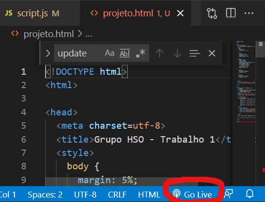
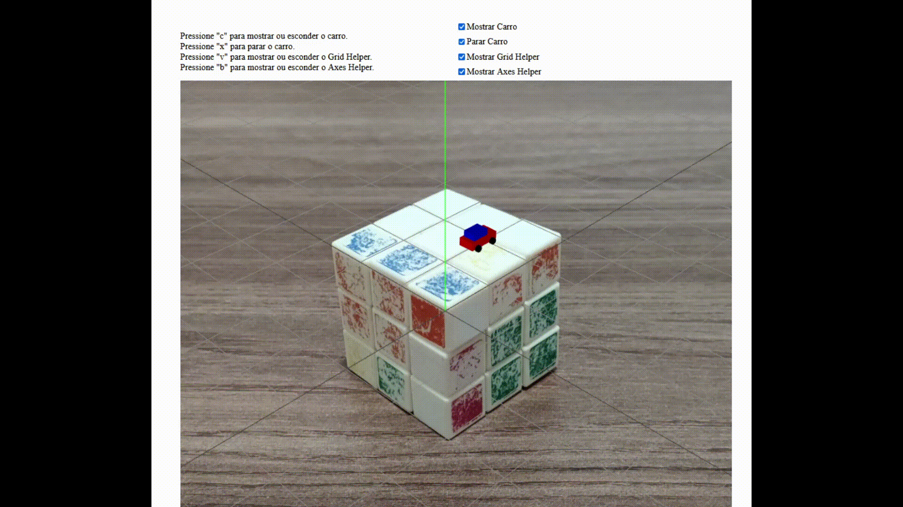

# CCI36-Realidade-Aumentada

---

- Carlos Renato de Andrade Figueiredo
- Matheus da Silva Martins
- Samara Ribeiro Silva

---

## Modo de execução e interação com a animação

Para executar o projeto deve-se descomprimir a pasta o arquivo compactado disponibilizado, ou fazer o download do projeto do github.

O projeto contém na raíz o arquivo html "projeto.html" e um README.md com instruções.

As imagens utilizadas para o trabalho foram armazenadas na pasta "img" enquanto os javascripts do three.js e o script com o código da animação ficam na pasta "js". A folha de estilos permaneceu fundida junto com a página html, escrita na parte do \<head\>.

Recomenda-se utilizar o programa visual [Visual Studio Code](https://code.visualstudio.com/download). Como servidor foi utilizado uma extensão chamada [Live Server](https://marketplace.visualstudio.com/items?itemName=ritwickdey.LiveServer).

Após instalados o programa e a extensão, abra a página "projeto.html" e basta clicar em "Go Live" no canto inferior direito da tela, conforme pode ser visto abaixo:

Automaticamente a página do browser se abrirá com a animação.

---

### Funcionamento da Animação:

